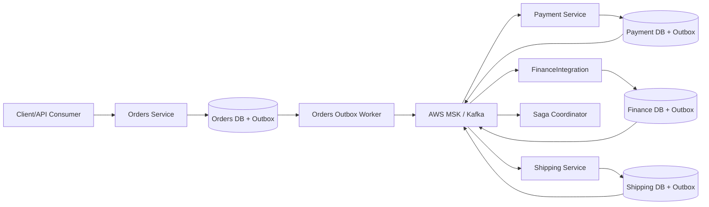
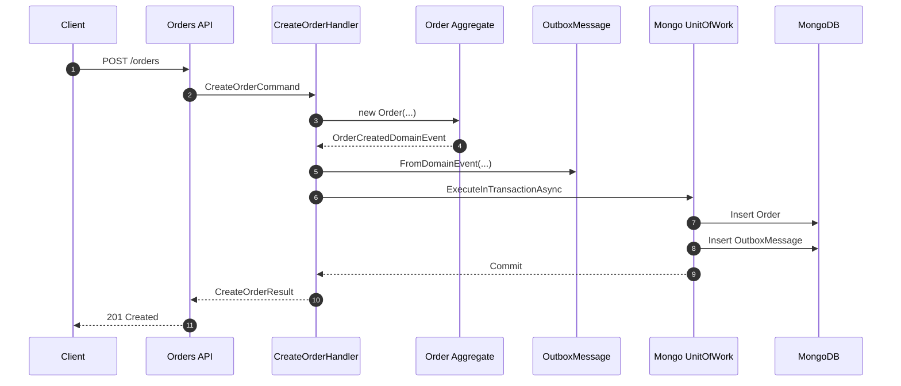
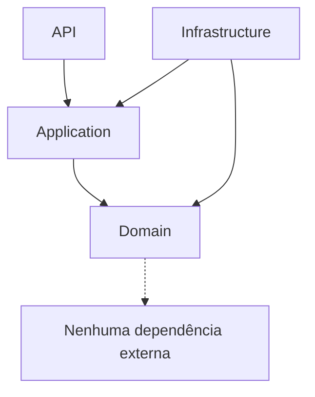
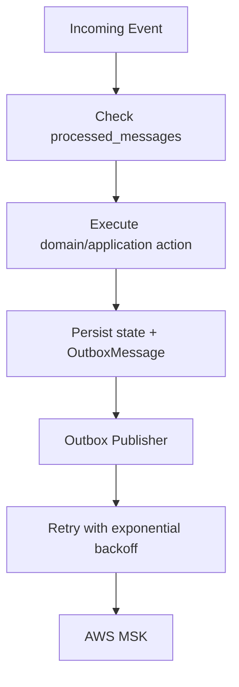
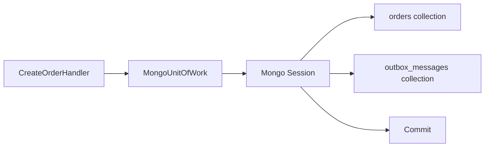

# Outbox Saga Lab

Um laboratório de arquitetura distribuída em **.NET 10**, criado para estudar, praticar e registrar decisões envolvendo **Clean Architecture**, **DDD**, **Outbox Pattern**, **MongoDB**, **AWS MSK/Kafka** e uma base evolutiva para **Sagas** em microsserviços.

A ideia deste projeto é ir um pouco além de uma API CRUD. O foco está em modelar decisões arquiteturais reais: consistência eventual, persistência confiável de eventos, separação de responsabilidades e preparação para comunicação assíncrona entre serviços.

## Objetivo

Este repositório faz parte do meu portfólio técnico e nasceu com uma intenção simples: construir um projeto onde a arquitetura aparece no código, não apenas no desenho.

O cenário base é simples:

- um pedido é criado no serviço de Orders;
- o domínio levanta eventos;
- a Application transforma esses eventos em mensagens de outbox;
- Order e Outbox são persistidos juntos em uma transação;
- futuramente, um worker publicará essas mensagens no AWS MSK;
- outros serviços, como Payment, FinanceIntegration e Shipping, poderão reagir e compor uma saga.



## Fluxo De Criação De Pedido



## Decisão Principal: Transactional Outbox

Em sistemas distribuídos, salvar dados e publicar eventos no broker são duas operações diferentes. Se uma delas falha, o sistema pode ficar inconsistente.

Exemplo do problema:

```text
1. Salva o pedido no banco
2. Falha antes de publicar OrderCreated no broker
3. Payment e Shipping nunca ficam sabendo do pedido
```

O Outbox Pattern resolve isso persistindo o evento no mesmo banco e na mesma transação do aggregate.

```text
Order + OutboxMessage = mesma transação
```

Depois, um worker independente lê a outbox e publica no broker com retry, controle de falhas e observabilidade.

## Camadas

```text
src/
  OutboxSaga.Order/
    OutboxSaga.Order.Api/
    OutboxSaga.Order.Application/
    OutboxSaga.Order.Domain/
    OutboxSaga.Order.Infrastructure/
```

### Domain

Contém o modelo de negócio puro.

Responsabilidades:

- aggregates;
- value objects;
- domain events;
- regras e invariantes;
- transições válidas de estado.

Exemplos:

- `Order`
- `OrderCustomer`
- `Money`
- `OrderStatus`
- `OrderCreatedDomainEvent`

O domínio não conhece MongoDB, HTTP, AWS MSK/Kafka ou qualquer detalhe externo.

### Application

Orquestra casos de uso.

Responsabilidades:

- receber commands;
- criar aggregates;
- coletar domain events;
- gerar mensagens de outbox;
- coordenar repositórios e Unit of Work;
- manter as regras de fluxo da aplicação.

Exemplo:

- `CreateOrderHandler`
- `CreateOrderCommand`
- `CreateOrderResult`
- `ICommandHandler<TCommand, TResult>`
- `IOutboxRepository`
- `IUnitOfWork`

### Infrastructure

Implementa detalhes externos.

Responsabilidades:

- MongoDB;
- repositories;
- transação;
- mapeamentos BSON;
- persistência de Orders;
- persistência de Outbox Messages.

Exemplos:

- `MongoContext`
- `MongoUnitOfWork`
- `MongoOrderRepository`
- `MongoOutboxRepository`
- `MongoMappings`

### API

Camada de entrada HTTP.

Responsabilidades:

- endpoints;
- contratos HTTP;
- composition root;
- OpenAPI/Scalar.

A API não deve carregar regra de negócio. Ela traduz request em command e delega para a Application.

## Fluxo De Dependências



A regra é simples: o domínio fica no centro.

Infraestrutura depende da aplicação, não o contrário. A Application define portas; a Infrastructure implementa adaptadores.

## Bounded Contexts E Contratos

Os bounded contexts devem se comunicar por eventos públicos versionados, não por compartilhamento de código de domínio.

```text
Orders (.NET)
  -> orders.events.v1

Payment
  -> payments.events.v1

FinanceIntegration (Python / externo)
  -> finance.events.v1

Shipping
  -> shipping.events.v1
```

`FinanceIntegration` é tratado como um contexto isolado. Na teoria, ele poderia ser mantido por outro time, com outro PO, outro repositório e outra stack.

Por isso, ele não deve depender de projetos `.csproj`, DTOs internos ou bibliotecas específicas dos serviços .NET.

O que pode ser compartilhado:

```text
contratos públicos em JSON Schema
nomes de topics
convenção de envelope
políticas arquiteturais
```

O que não deve ser compartilhado:

```text
domínio
repositórios
DTOs internos
implementação de outbox
implementação de idempotência
```

Os contratos públicos ficam em `contracts/`.

## Padrões Mantidos

Cada bounded context deve implementar os mesmos padrões, mas com autonomia.

- **Outbox:** cada serviço possui seu próprio outbox local.
- **Idempotência:** consumers verificam mensagens já processadas antes de executar efeitos colaterais.
- **Resiliência:** publicação de eventos com retry e exponential backoff.
- **Observabilidade:** propagação de `correlation_id`, `causation_id`, `message_id` e `event_type`.
- **Shared Nothing:** cada serviço mantém seu próprio banco, seu próprio outbox e sua própria implementação.



O padrão de outbox é o mesmo entre os serviços, mas a tabela/collection não é compartilhada.

```text
Orders DB                -> outbox_messages
Payment DB               -> outbox_messages
FinanceIntegration DB    -> outbox_messages
Shipping DB              -> outbox_messages
```

## MongoDB E Transação

O projeto usa MongoDB para persistir:

- orders;
- outbox messages.

A transação é coordenada por `MongoUnitOfWork`, garantindo que o pedido e sua mensagem de outbox sejam persistidos juntos.



Observação: transações no MongoDB exigem replica set ou cluster. Em MongoDB Atlas isso já faz sentido para o cenário do projeto.

## Por Que O AggregateRoot Guarda Eventos?

O aggregate é quem sabe quando algo relevante aconteceu no domínio.

Quando um `Order` é criado, ele levanta um `OrderCreatedDomainEvent`. Ele não publica no broker, não serializa JSON e não conhece outbox. Ele apenas registra o fato de domínio.

Isso mantém as responsabilidades bem separadas:

```text
Domain: aconteceu algo
Application: transforma em mensagem
Infrastructure: persiste/publica
```

## Stack

- C# / .NET 10
- ASP.NET Core Minimal APIs
- MongoDB Driver
- MongoDB Atlas
- AWS MSK / Kafka
- Clean Architecture
- DDD
- Transactional Outbox
- Idempotência
- Base para Saga Pattern
- Scalar/OpenAPI

## Como Rodar

Configure a connection string do MongoDB em variável de ambiente ou user-secrets.

Exemplo:

```powershell
dotnet user-secrets set "MongoDb:ConnectionString" "mongodb+srv://user-service-saga-lab:<db_password>@cluster0.lrlk00w.mongodb.net/?appName=Cluster0" --project src/OutboxSaga.Order/OutboxSaga.Order.Api
dotnet user-secrets set "MongoDb:DatabaseName" "OutboxSagaDb" --project src/OutboxSaga.Order/OutboxSaga.Order.Api
```

Depois:

```powershell
dotnet build src/OutboxSaga.Order/OutboxSaga.Order.Api/OutboxSaga.Orders.Api.csproj
dotnet run --project src/OutboxSaga.Order/OutboxSaga.Order.Api/OutboxSaga.Orders.Api.csproj
```

## Próximos Passos

- Implementar o Outbox Worker.
- Publicar eventos no AWS MSK.
- Adicionar Payment Service.
- Criar o boundary externo `FinanceIntegration`.
- Adicionar Shipping Service.
- Evoluir o Saga Coordinator.
- Adicionar retries e dead-letter strategy.
- Adicionar observabilidade com logs estruturados, tracing e métricas.
- Validar contratos versionados em `contracts/`.
- Criar testes de domínio, application e integração.

## Status

Projeto em evolução.

A base atual já cobre o fluxo de criação de pedido com persistência transacional em MongoDB e registro de mensagens na outbox. O próximo grande passo é processar a outbox e iniciar a comunicação assíncrona pelo AWS MSK.
