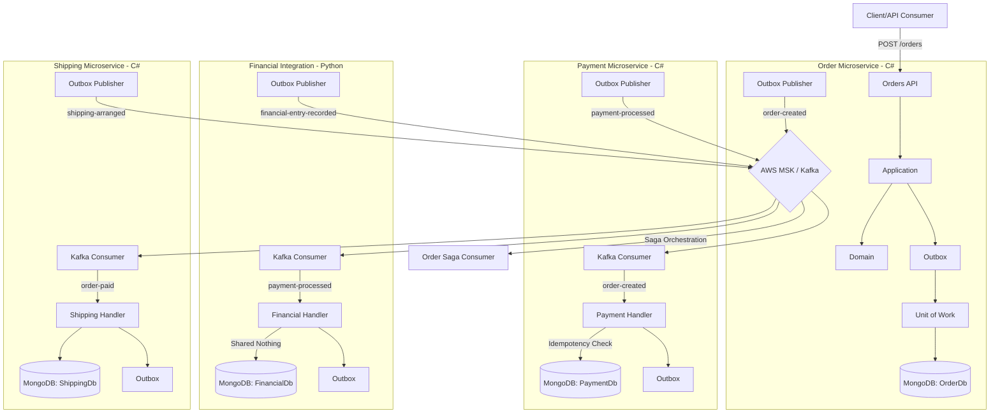

# Outbox Saga Lab

Um laboratório de arquitetura distribuída em **.NET 10** e **Python**, criado para estudar, praticar e registrar decisões envolvendo **Clean Architecture**, **DDD**, **Outbox Pattern**, **Saga Orchestration**, **MongoDB** e **AWS MSK (Kafka)**.

A ideia deste projeto é ir além de uma API CRUD, modelando decisões arquiteturais reais: consistência eventual, persistência confiável de eventos, isolamento de microsserviços e resiliência em sistemas distribuídos.

## Objetivo

Este repositório serve como base de estudo para o papel de **Staff Architect**, onde cada componente é desenhado para suportar falhas parciais e garantir a rastreabilidade total do processo de negócio. O uso de múltiplas linguagens (.NET e Python) demonstra como os padrões arquiteturais se aplicam independentemente da stack tecnológica.

O cenário evoluiu para:

- **Order Service (C#):** Orquestrador da Saga. Cria o pedido e coordena o fluxo.
- **Payment Service (C#):** Reage à criação do pedido, processa o pagamento de forma idempotente e registra o resultado via Outbox.
- **Shipping Service (C#):** Reage ao pagamento aprovado e prepara a logística de entrega.
- **Financial Integration (Python):** Realiza a escrituração contábil após o pagamento, demonstrando autonomia total (Shared Nothing).
- **Messaging Service (C#):** Biblioteca de contratos para os serviços .NET. O serviço Python define seus próprios esquemas para evitar acoplamento binário.



## Decisões Arquiteturais (Nível Staff)

### 1. Transactional Outbox (Shared Nothing)
Cada serviço implementa sua própria lógica de Outbox e Publisher. Isso evita o acoplamento por "Shared Library" de infraestrutura. No serviço Python, utilizamos o driver assíncrono `motor` com sessões para manter a paridade com a implementação C#.

### 2. Idempotência (Inbox Pattern)
Como o Kafka garante a entrega *at-least-once*, todos os consumidores realizam uma verificação de idempotência no banco de dados antes de processar qualquer mensagem.

### 3. Distributed Tracing (Correlation & Causation)
As mensagens trafegam com `CorrelationId` e `CausationId`. O serviço Python extrai esses valores dos Headers do Kafka e os propaga em seus próprios eventos de saída.

### 4. Resiliência e Polly/Tenacity
- **C#:** Polly para Retry com Exponential Backoff.
- **Python:** Tenacity para garantir que a publicação no Kafka suporte falhas transientes do broker.

### 5. Fat Events & Autonomia
Os eventos carregam dados ricos. O serviço FinancialIntegration (Python) não conhece as classes C#; ele consome o JSON e valida os dados usando `Pydantic`, mantendo a autonomia total sugerida pelo padrão **Shared Nothing**.

## Camadas

```text
src/
  OutboxSaga.Messaging/           # Contratos .NET
  OutboxSaga.Order/               # .NET 10 API
  OutboxSaga.Payment/             # .NET 10 Worker
  OutboxSaga.Shipping/            # .NET 10 Worker
  OutboxSaga.FinancialIntegration/ # Python 3.12+ Worker
  OutboxSaga.Infrastructure/AWS/  # Terraform para AWS MSK
```

## Infraestrutura AWS (MSK)

Para provisionar o cluster de Kafka na AWS, utilize o Terraform na pasta `src/OutboxSaga.Infrastructure/AWS`:

```bash
cd src/OutboxSaga.Infrastructure/AWS
terraform init
terraform apply
```

O output `bootstrap_brokers` deve ser copiado para as configurações de `Kafka:BootstrapServers` nos arquivos `appsettings.json` de cada serviço.

## Stack

- **Linguagens:** C# (.NET 10), Python (3.12+)
- **Bancos:** MongoDB Atlas (Transacional)
- **Mensageria:** AWS MSK / Confluent Kafka
- **IaC:** Terraform
- **Libs Python:** motor, confluent-kafka, pydantic, tenacity

## Status

**Fase 3 Concluída:** Introdução de poliglotismo com o serviço de Financial Integration em Python. Infraestrutura AWS MSK preparada via Terraform.
