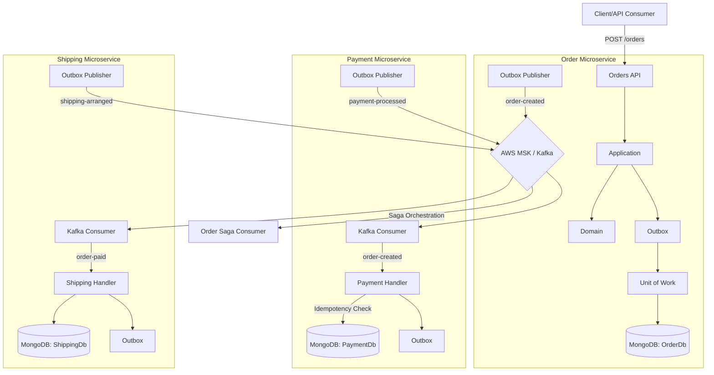

# Outbox Saga Lab

Um laboratório de arquitetura distribuída em **.NET 10**, criado para estudar, praticar e registrar decisões envolvendo **Clean Architecture**, **DDD**, **Outbox Pattern**, **Saga Orchestration**, **MongoDB** e **AWS MSK (Kafka)**.

A ideia deste projeto é ir além de uma API CRUD, modelando decisões arquiteturais reais: consistência eventual, persistência confiável de eventos, isolamento de microsserviços e resiliência em sistemas distribuídos.

## Objetivo

Este repositório serve como base de estudo para o papel de **Staff Architect**, onde cada componente é desenhado para suportar falhas parciais e garantir a rastreabilidade total do processo de negócio.

O cenário evoluiu para:

- **Order Service:** Orquestrador da Saga. Cria o pedido e coordena o fluxo.
- **Payment Service:** Reage à criação do pedido, processa o pagamento de forma idempotente e registra o resultado via Outbox.
- **Shipping Service:** Reage ao pagamento aprovado e prepara a logística de entrega.
- **Messaging Service:** Biblioteca compartilhada de contratos (Fat Events) para garantir o desacoplamento binário.



## Decisões Arquiteturais (Nível Staff)

### 1. Transactional Outbox (Shared Nothing)
Cada serviço implementa sua própria lógica de Outbox e Publisher. Isso evita o acoplamento por "Shared Library" de infraestrutura, permitindo que cada serviço evolua seu banco de dados ou estratégia de persistência de forma independente.

### 2. Idempotência (Inbox Pattern)
Como o Kafka garante a entrega *at-least-once*, os consumidores de Payment e Shipping realizam uma verificação de idempotência no banco de dados antes de processar qualquer mensagem, evitando duplicidade de cobranças ou envios.

### 3. Distributed Tracing (Correlation & Causation)
Todas as mensagens trafegam com:
- **CorrelationId:** Identificador único da jornada do pedido, permitindo rastrear o fluxo completo nos logs de todos os serviços.
- **CausationId:** Identificador da mensagem que causou a ação atual, permitindo reconstruir a árvore de eventos.

### 4. Resiliência com Polly
O `OutboxPublisherService` utiliza políticas de **Retry com Exponential Backoff** via Polly para lidar com instabilidades temporárias no Broker de mensagens.

### 5. Fat Events
Os eventos carregam dados suficientes para que o próximo serviço processe sua lógica sem precisar consultar o serviço anterior (API Call síncrona), preservando a autonomia.

## Camadas

```text
src/
  OutboxSaga.Messaging/      # Contratos de eventos compartilhados
  OutboxSaga.Order/          # API e Orquestrador de Pedidos
  OutboxSaga.Payment/        # Worker de Processamento de Pagamento
  OutboxSaga.Shipping/       # Worker de Logística e Envio
```

## Stack

- C# / .NET 10
- MongoDB Atlas (com Client Sessions para Transações)
- Confluent.Kafka (AWS MSK Ready)
- Polly (Resiliência)
- Clean Architecture & DDD

## Próximos Passos

- Implementar as **Compensating Transactions** (Estorno de pagamento se o envio falhar).
- Adicionar **Dead Letter Queues (DLQ)** para mensagens malformadas.
- Implementar **Dashboard de Observabilidade** consumindo o CorrelationId.

## Status

**Fase 2 Concluída:** Infraestrutura de Outbox e serviços de Payment/Shipping implementados e operacionais. Próximo foco: Lógica de compensação e orquestração fina no Order Service.
