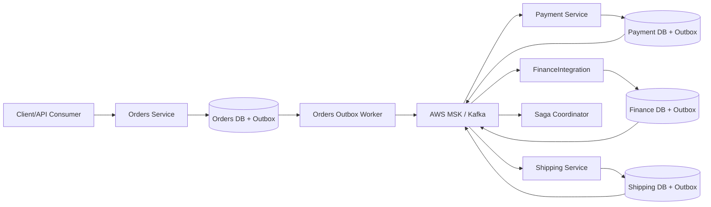
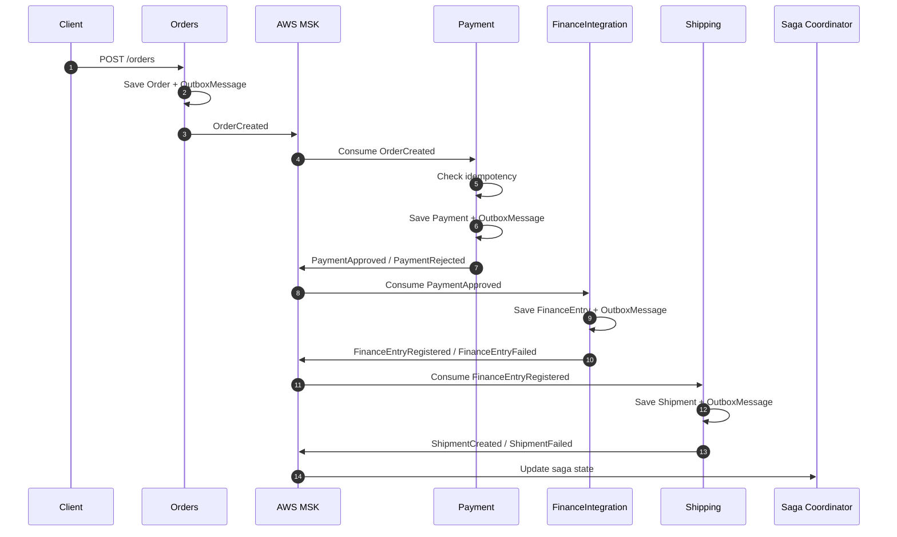

# Outbox Saga Lab

Um laboratório de arquitetura distribuída em **.NET 10**, criado para estudar, praticar e registrar decisões envolvendo **Clean Architecture**, **DDD**, **Outbox Pattern**, **MongoDB**, **AWS MSK/Kafka** e uma base evolutiva para **Sagas** em microsserviços.

A ideia deste projeto é ir além de uma API CRUD, modelando decisões arquiteturais reais: consistência eventual, persistência confiável de eventos, isolamento de microsserviços e resiliência em sistemas distribuídos.

## Objetivo

Este repositório serve como base de estudo para arquitetura distribuída. A proposta é manter a arquitetura visível no código, sem esconder decisões importantes em abstrações genéricas demais.

O cenário evoluiu para:

- **Orders:** cria o pedido, registra eventos de domínio e persiste mensagens na outbox.
- **Payment:** consome eventos de pedido, processa pagamento de forma idempotente e publica o resultado via outbox.
- **FinanceIntegration:** boundary externo planejado para integração financeira/ERP/SAP, possivelmente em Python.
- **Shipping:** consome eventos de fluxo aprovado e prepara a logística de entrega.
- **AWS MSK/Kafka:** canal assíncrono entre os bounded contexts.



## Fluxo Da Saga



## Decisões Arquiteturais

### 1. Transactional Outbox

Cada serviço persiste seu estado e sua mensagem de outbox na mesma transação local.

```text
Aggregate + OutboxMessage = mesma transação local
```

Isso evita o problema clássico de salvar no banco e falhar antes de publicar no broker.

### 2. Shared Nothing

Cada bounded context mantém seu próprio banco, seu próprio outbox e sua própria implementação de publicação/consumo.

O padrão se repete de forma intencional. A repetição aqui protege autonomia.

```text
Orders DB                -> outbox_messages
Payment DB               -> outbox_messages
FinanceIntegration DB    -> outbox_messages
Shipping DB              -> outbox_messages
```

### 3. Idempotência

Como Kafka trabalha naturalmente com entrega *at-least-once*, consumers precisam verificar mensagens já processadas antes de executar efeitos colaterais.

Exemplos de efeitos colaterais que não devem duplicar:

- cobrança;
- registro financeiro;
- criação de envio;
- atualização de estado da saga.

### 4. Observabilidade

Eventos carregam identificadores para rastreabilidade do fluxo:

- `message_id`
- `correlation_id`
- `causation_id`
- `event_type`
- `event_version`

`correlation_id` acompanha a jornada inteira.

`causation_id` aponta qual mensagem causou o próximo evento.

### 5. Resiliência

Publicadores de outbox usam retry com exponential backoff para falhas transitórias no broker.

Mensagens malformadas ou falhas permanentes devem evoluir para uma estratégia de DLQ ou intervenção manual.

### 6. Contratos Públicos Versionados

Bounded contexts devem se comunicar por eventos públicos versionados, não por compartilhamento de domínio.

O que pode ser compartilhado:

```text
contratos JSON Schema
nomes de topics
convenção de envelope
políticas arquiteturais
```

O que não deve ser compartilhado:

```text
domínio
repositórios
DTOs internos
implementação de outbox
implementação de idempotência
```

Os contratos ficam em `contracts/`.

## Messaging

`OutboxSaga.Messaging` deve ser tratado como building block técnico, não como pacote de domínio compartilhado.

Ele pode conter:

- envelope de integração;
- nomes de headers;
- helpers técnicos.

Ele não deve conter:

- `OrderCreated`;
- `PaymentApproved`;
- `FinanceEntryRegistered`;
- `ShipmentCreated`;
- qualquer evento específico de um bounded context.

Esses eventos pertencem aos contratos públicos versionados e às bordas dos serviços que os publicam/consomem.

## Camadas

```text
src/
  OutboxSaga.Messaging/
  OutboxSaga.Order/
    OutboxSaga.Order.Api/
    OutboxSaga.Order.Application/
    OutboxSaga.Order.Domain/
    OutboxSaga.Order.Infrastructure/
  OutboxSaga.Payment/
    OutboxSaga.Payment.Application/
    OutboxSaga.Payment.Domain/
    OutboxSaga.Payment.Infrastructure/
    OutboxSaga.Payment.Worker/
  OutboxSaga.Shipping/
    OutboxSaga.Shipping.Application/
    OutboxSaga.Shipping.Domain/
    OutboxSaga.Shipping.Infrastructure/
    OutboxSaga.Shipping.Worker/
```

## FinanceIntegration

`FinanceIntegration` é planejado como um boundary externo, possivelmente em Python, simulando integração com ERP/SAP ou outro sistema financeiro.

A premissa é que ele poderia ser mantido por outro time, com outro PO, outro repositório e outro ciclo de deploy.

Por isso, ele deve integrar por:

```text
AWS MSK + contratos públicos
```

E não por:

```text
DLL compartilhada
DTO interno
referência direta a projeto .NET
```

Detalhes: `docs/finance-integration-boundary.md`.

## Stack

- C# / .NET 10
- ASP.NET Core Minimal APIs
- Worker Services
- MongoDB Atlas
- MongoDB Driver
- AWS MSK / Kafka
- Confluent.Kafka
- Polly
- Clean Architecture
- DDD
- Transactional Outbox
- Idempotência
- Base para Saga Pattern
- Scalar/OpenAPI

## Como Rodar

Configure a connection string do MongoDB em variável de ambiente ou user-secrets.

Exemplo para Orders:

```powershell
dotnet user-secrets set "MongoDb:ConnectionString" "mongodb+srv://user-service-saga-lab:<db_password>@cluster0.lrlk00w.mongodb.net/?appName=Cluster0" --project src/OutboxSaga.Order/OutboxSaga.Order.Api
dotnet user-secrets set "MongoDb:DatabaseName" "OutboxSagaDb" --project src/OutboxSaga.Order/OutboxSaga.Order.Api
```

Build:

```powershell
dotnet build src/OutboxSaga.Order/OutboxSaga.Order.Api/OutboxSaga.Orders.Api.csproj
dotnet build src/OutboxSaga.Payment/OutboxSaga.Payment.Worker/OutboxSaga.Payment.Worker.csproj
dotnet build src/OutboxSaga.Shipping/OutboxSaga.Shipping.Worker/OutboxSaga.Shipping.Worker.csproj
```

## Próximos Passos

- Refinar os contratos públicos em `contracts/`.
- Implementar o boundary externo `FinanceIntegration`.
- Evoluir o Saga Coordinator.
- Implementar compensações.
- Adicionar DLQ.
- Melhorar observabilidade com logs estruturados, tracing e métricas.
- Adicionar testes de domínio, application e integração.

## Status

Projeto em evolução.

A base atual cobre criação de pedido, outbox transacional em Orders e a evolução para serviços de Payment e Shipping com workers, MongoDB e publicação assíncrona preparada para AWS MSK.
