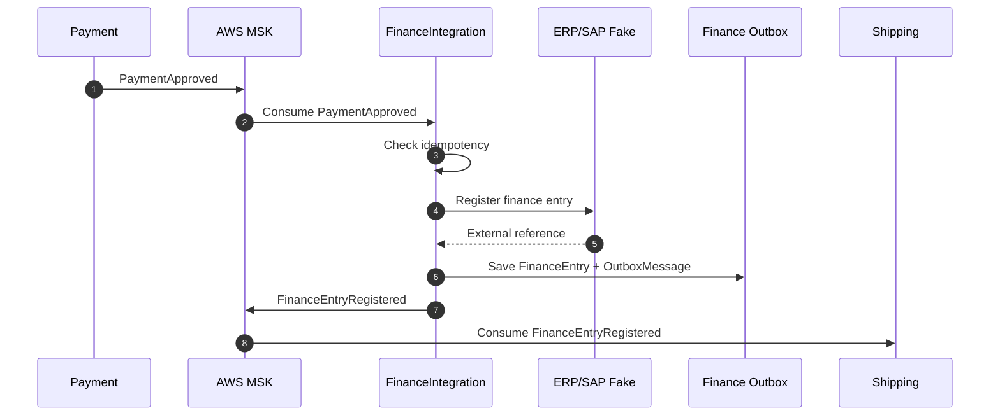

# FinanceIntegration Boundary

`FinanceIntegration` representa um bounded context separado do core em .NET.

A premissa arquitetural é que ele poderia pertencer a outro time, com outro ciclo de entrega, outro PO e outra stack. Por isso, ele não deve depender de projetos `.csproj`, classes C# ou bibliotecas internas do ecossistema `OutboxSaga`.

Ele integra por contrato público e broker.

## Responsabilidade

Consumir eventos de pagamento aprovado, registrar uma entrada financeira em um sistema externo simulado, como ERP/SAP, e publicar o resultado da integração.

```text
PaymentApproved
  -> FinanceIntegration
  -> FinanceEntryRegistered ou FinanceEntryFailed
```

## Fora Do Escopo

`FinanceIntegration` não é o domínio financeiro completo.

Ele não decide regra de pagamento, não agenda entrega e não altera diretamente o estado de Orders. Ele apenas registra a etapa financeira externa e publica o resultado para a saga continuar.

## Isolamento

```text
FinanceIntegration
  - não referencia OutboxSaga.Messaging.dll
  - não referencia OutboxSaga.Order.Domain
  - não reutiliza DTO interno de outro serviço
  - não depende de solution .NET
  - consome contratos JSON versionados
  - publica eventos no AWS MSK
```

## Contratos

Contratos públicos ficam em `contracts/`.

Para esse boundary:

```text
contracts/payments/payment-approved.v1.schema.json
contracts/finance/finance-entry-registered.v1.schema.json
contracts/finance/finance-entry-failed.v1.schema.json
```

## Padrões Obrigatórios

Mesmo isolado, o serviço deve seguir os mesmos padrões arquiteturais dos demais bounded contexts.

### Outbox

Cada serviço implementa seu próprio outbox.

O outbox não deve ser uma biblioteca compartilhada de domínio. O padrão é repetido de forma intencional para preservar autonomia e evitar acoplamento entre times.

```text
FinanceEntry + OutboxMessage = mesma transação local
```

Isso significa que `FinanceIntegration` terá uma tabela/collection de outbox própria, por exemplo:

```text
finance_integration.outbox_messages
```

Ela pode seguir a mesma estrutura conceitual usada pelos outros serviços, mas não deve ser a mesma tabela/collection física de `Orders`, `Payment` ou `Shipping`.

```text
Orders DB
  - orders
  - outbox_messages

Payment DB
  - payments
  - outbox_messages

FinanceIntegration DB
  - finance_entries
  - outbox_messages

Shipping DB
  - shipments
  - outbox_messages
```

### Idempotência

Todo consumer deve registrar mensagens processadas antes de executar efeitos colaterais não idempotentes.

Chave sugerida:

```text
message_id
```

Alternativas aceitáveis:

```text
event_type + event_version + source + message_id
```

Estrutura sugerida:

```text
processed_messages
  - message_id
  - event_type
  - consumer_name
  - processed_at_utc
```

### Resiliência

Publicação no AWS MSK deve usar retry com exponential backoff.

Falhas transitórias podem ser reprocessadas. Falhas permanentes devem ir para estratégia de dead-letter ou intervenção manual.

### Observabilidade

Todo fluxo deve propagar:

```text
correlation_id
causation_id
message_id
event_type
event_version
```

`correlation_id` acompanha a saga inteira.

`causation_id` aponta para a mensagem que causou o novo evento.

### Shared Nothing

Cada bounded context possui seu próprio banco, seu próprio outbox e sua própria implementação de publicação/consumo.

O que é compartilhado:

```text
contratos públicos
nomes de topics
convenções de envelope
políticas arquiteturais
```

O que não é compartilhado:

```text
modelo de domínio
repositórios
DTOs internos
implementação de outbox
implementação de idempotência
```

## Fluxo Na Saga



## Resultado Esperado

Essa separação permite evoluir `FinanceIntegration` em Python, com seu próprio repositório no futuro, mantendo compatibilidade pelo contrato público e não por compartilhamento de código.
